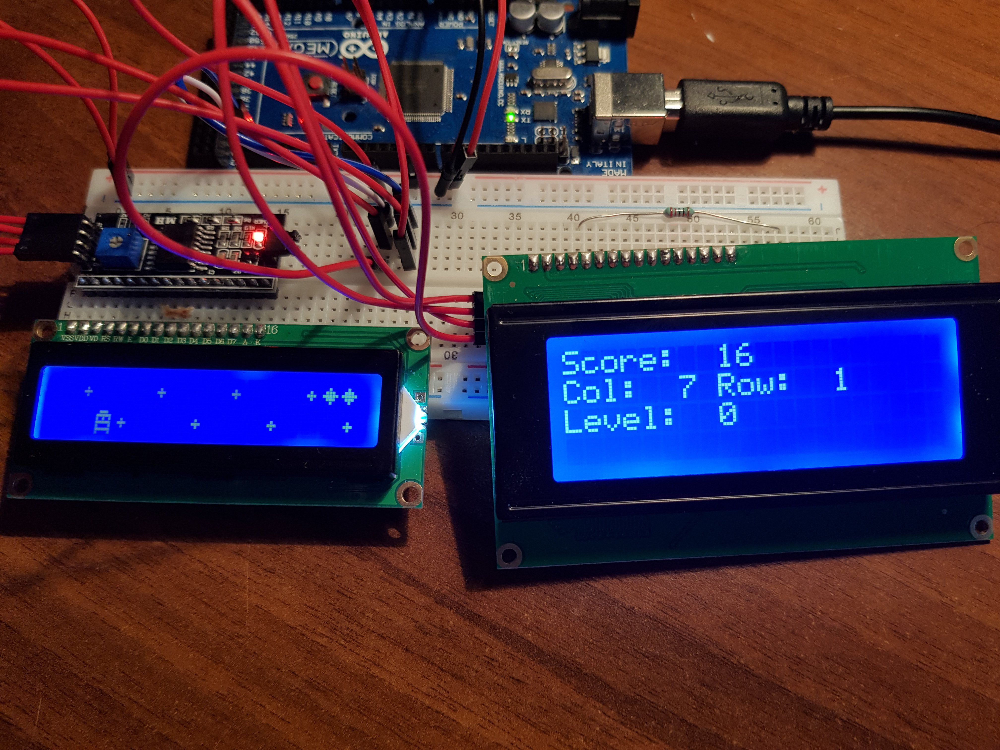

# interrupt2Catafano

Operating Systems Project * A.A. 2018/2019 * by prof. Giorgio Grisetti.
Implementation of the i2c protocol from scratch.

# What
Realization of `i2c` driver for * Master / Slave * communication between` Arduino` and `device i2c`.
In particular, two versions have been created:
1. `i2c/basic`: primitive i2c communication standards.
     To test these drivers, two test main * Master / Slave * were created between two different ATMega
     * (code available in the directory `examples / [master / slave])` *

2. `i2c/interrupt`: driver i2c realized with Interrupt and used in the upper layer `Comunication.h`
     to allow ** Multi-Slave ** communication

Also, the driver for ** LCD devices ** was built using the `comunication.h` layer below.
The driver allows:
- management of different displays (tested 16x2 and 20x4)
- Screen shifting
- Custom font creation

As an example of how serial communication and the i2c driver work, we have created a video game "freely inspired" by Pacman.


| Master/Slave - 1 : 1| Master/Slave - 1 : n |
|--------------|---------------|
|              | my_lcd_i2c    |
|              | comunication  |
| i2c/basic    | i2c/interrupt |



# How
In the initial phase to fully understand the functioning of the protocol we have created the `Basic` version.
Subsequently we have created the version with interrupt and with the support of the Multi-slave (therefore with separation of the addresses both at hardware and software level).

Many difficulties * (and not only) * have arisen for the realization of non-standard communication, in particular:

-  Arduino: lettura disabilitando interrupt in modalità non bloccante 
- PC: Opening UART correctly and defining primitives for communication
- Display: Understanding of low-level screen operation, especially shift

**Note:** The screen is not completely refreshed every time (due to time problems) and an entire shift is made to the display.
However, the display does not maintain an absolute reference of the columns, but changes them at each shift. * (Ex. Column 3 moves with each shift.) *


# How to Run
To run it is necessary to compile:
- `pc_server`
- `arduino client`
Then:

```s
cd avr/arduino_client
make
make arduino_client.hex

cd ../../pc_server
make
./i2c_videogame 0 # 0 se device su ttyACMO, 1 se ttyACM1
```
Now you can have fun: smirk:

## How the game works
The core of the game is located on the Arduino, while the user input is managed by the PC keyboard.
Communication between Arduino and PC is done via serial port.

Here are the various steps of the game:

1 - At start-up, the PC waits for the Arduino to be ready; once synchronized, `start` will appear on both screens.

2 - The Player's data (* name and desired difficulty *) are entered via the keyboard.

3 - Arduino is independent from the pc, so the game continues even if no keys are pressed on the keyboard. At each refresh step it sends a `life or death` message to the PC to communicate the game status.

4 - When the player dies the score is printed on both screens and Arduino is waiting for a new game.


# Authors 
- Francesco Colasante
- Luca Gioffrè
- Gianmarco D'Alessandro
- Alessandro Accardo
